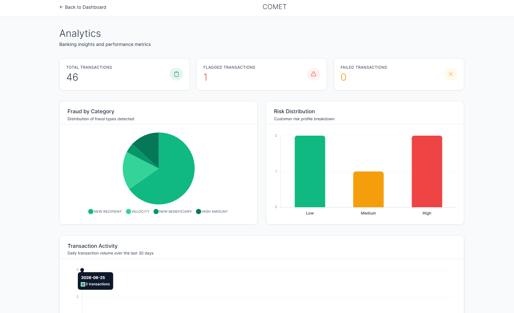
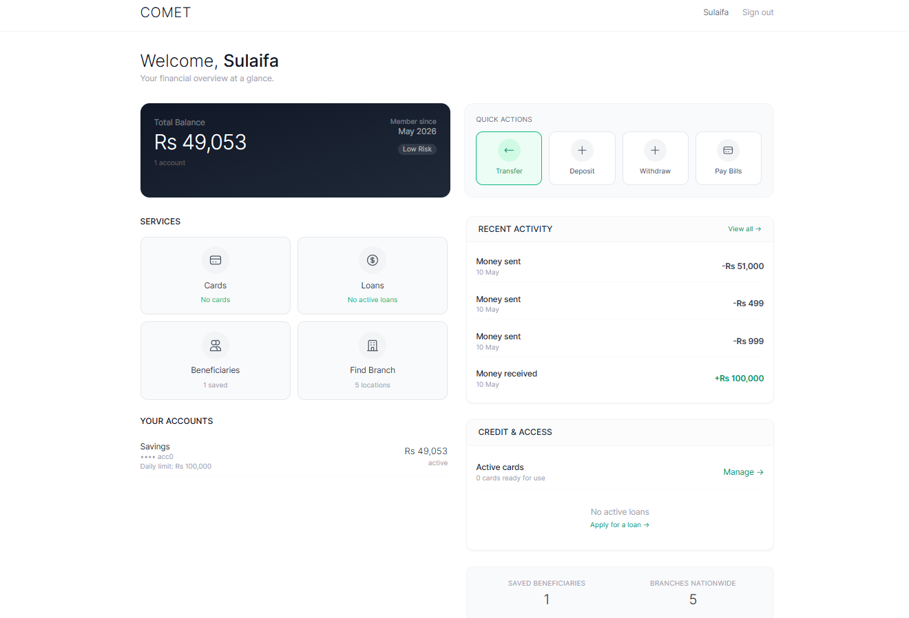
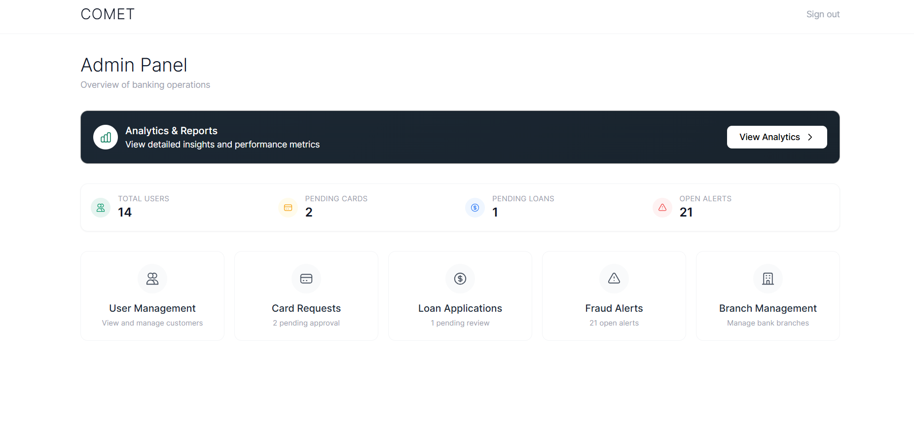
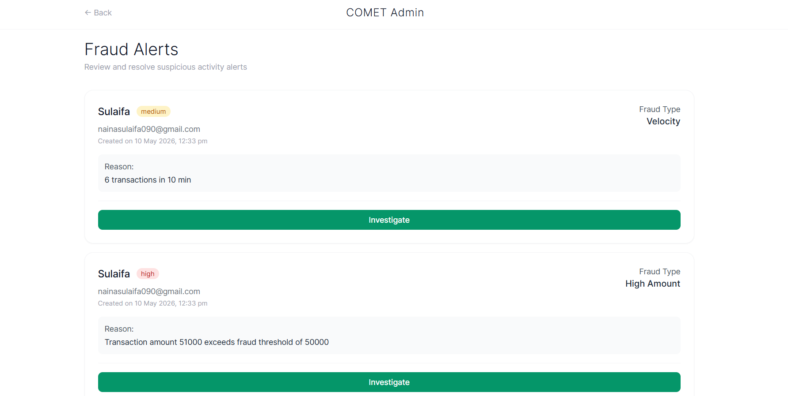
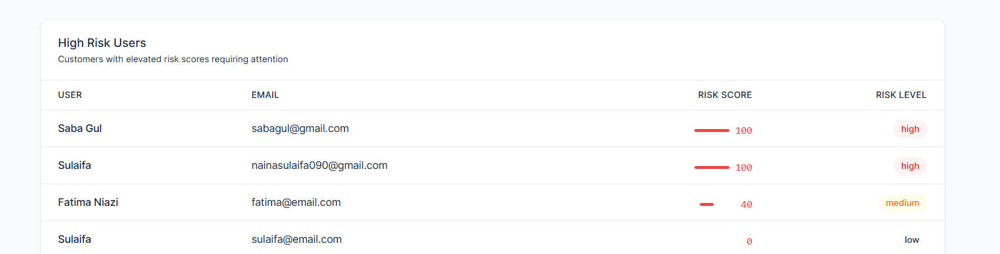

# COMET – Real-Time Fraud Detection Banking System




A full-stack banking management system built using the **MERN Stack** that simulates a secure digital banking environment. COMET provides dedicated portals for customers, employees, and administrators while integrating secure authentication, transaction management, loan processing, fraud detection, and database optimization into a single platform.

The project was developed to explore modern backend development, secure authentication, database optimization, and real-world software engineering practices.

---

#  Features

### Customer Portal
- Secure Login with OTP Verification
- Personalized Account Dashboard
- Money Transfers
- Bill Payments
- Loan Applications
- Card Service Requests
- Branch Locator
- Transaction History

###  Employee Portal
- Customer Management
- Loan Approval & Processing
- Card Request Management
- Transaction Monitoring
- Customer Support Operations

###  Administrator Dashboard
- User Management
- Branch Management
- Banking Analytics
- Fraud Monitoring
- Risk User Analysis
- System Administration

###  Security
- JWT Authentication
- Role-Based Access Control (RBAC)
- OTP Verification
- Location-Based Fraud Detection
- Automatic Risk Alerts
- High-Risk Account Monitoring
- Account Freeze for Suspicious Activity

###  Database & Backend
- MongoDB Indexing
- Aggregation Pipelines
- Schema Validation
- TTL Indexes for Automatic Session Expiration
- Concurrency Control for Sensitive Banking Transactions

---

#  Application Overview

##  Customer Dashboard

The customer dashboard provides quick access to account information, recent transactions, and essential banking services such as transfers, bill payments, loans, and card requests.



---

##  Employee Dashboard

Employees can manage customer accounts, process loan applications, monitor transactions, and handle daily banking operations from a centralized dashboard.



---

##  Administrator Analytics Dashboard

Administrators can monitor banking activity through visual analytics, track system performance, and gain insights into transactions and user activity.


---

##  Fraud Detection Dashboard

The fraud monitoring module identifies suspicious banking activity using location-based risk analysis and enables administrators to investigate and respond to potential threats.



---

##  Risk User Analytics

High-risk users are automatically highlighted based on suspicious behavior, allowing administrators to review accounts and take appropriate security actions.



---

#  Tech Stack

### Frontend
- React.js
- HTML5
- CSS3
- JavaScript
- Tailwind CSS

### Backend
- Node.js
- Express.js
- REST APIs
- JWT Authentication

### Database
- MongoDB

### Tools
- Git
- GitHub
- Postman

---

#  Project Structure

```text
COMET/
├── banking-frontend/
├── banking-backend/
├── screenshots/
└── README.md
```

---

#  Learning Outcomes

This project strengthened my understanding of:

- Full-Stack MERN Development
- Secure Authentication & Authorization
- Backend API Development
- Database Design & Optimization
- MongoDB Indexing & Aggregation Pipelines
- Role-Based Access Control (RBAC)
- Fraud Detection Workflows
- Concurrency Control
- Building Secure & Scalable Applications

---

#  Future Improvements

- AI/ML-based Fraud Detection
- Two-Factor Authentication (2FA)
- Email & SMS Notifications
- Docker Containerization
- Cloud Deployment
- Real-Time Transaction Notifications

---


- **Fatima Niazi** - [@Fatimaniazi09](https://github.com/Fatimaniazi09)
- **Sulaifa** - [@USERNAME](https://github.com/USERNAME)
